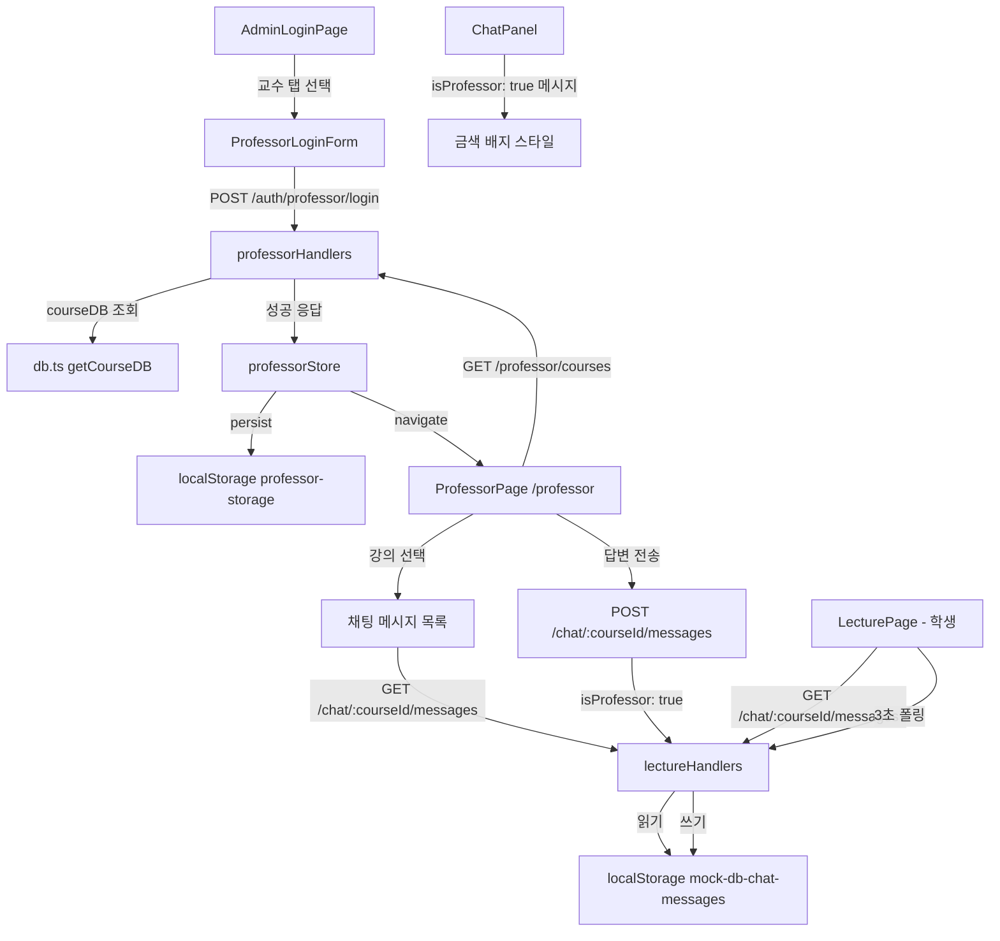

# Design Document

## Overview

현규대학교 LMS에 교수 로그인 및 강의 채팅 Q&A 기능을 추가한다.

핵심 설계 원칙:
- **교수 계정 동적 생성**: courseDB의 `professorName` 필드를 기반으로 교수 계정을 런타임에 동적으로 생성한다. 하드코딩된 더미 계정은 없다.
- **강의 접근 제어**: 각 교수는 courseDB에서 자신의 `professorName`과 일치하는 강의에만 접근할 수 있다.
- **채팅 영구 저장**: 채팅 메시지는 localStorage 키 `mock-db-chat-messages`에 저장되어 새로고침 후에도 유지된다.
- **교수 메시지 구분**: `isProfessor: true` 플래그로 교수 메시지를 식별하고 시각적으로 구분한다.

기존 관리자 시스템(`adminStore`, `AdminLoginPage`, `AdminPage`)의 패턴을 그대로 따르되, 교수 전용 인증 흐름과 대시보드를 별도로 구성한다.

---

## Architecture



### 데이터 흐름

1. **교수 인증**: `AdminLoginPage` → 교수 탭 → `POST /auth/professor/login` → `professorStore` (Zustand persist)
2. **강의 조회**: `ProfessorPage` → `GET /professor/courses` (Authorization 헤더) → courseDB 필터링
3. **채팅 읽기**: `GET /chat/:courseId/messages` → localStorage `mock-db-chat-messages` 읽기
4. **채팅 쓰기**: `POST /chat/:courseId/messages` (isProfessor 포함) → localStorage 즉시 저장
5. **학생 채팅**: 기존 `ChatPanel` 3초 폴링 → 교수 메시지 시각적 구분 렌더링

---

## Components and Interfaces

### 신규 파일

#### `src/store/professorStore.ts`

```typescript
interface ProfessorState {
  isProfessorAuthenticated: boolean
  professorToken: string | null
  professorName: string | null
  setProfessorAuth: (token: string, name: string) => void
  professorLogout: () => void
}
```

`adminStore.ts`와 동일한 Zustand persist 패턴을 사용한다. localStorage 키는 `professor-storage`, partialize로 `professorToken`과 `professorName`을 저장하고, onRehydrateStorage에서 토큰 존재 시 `isProfessorAuthenticated: true`로 복원한다.

#### `src/pages/ProfessorLoginPage.tsx` (내부 컴포넌트)

`AdminLoginPage.tsx`에 탭 UI를 추가하는 방식으로 구현한다. 별도 파일이 아닌 `AdminLoginPage.tsx` 내부에 교수 로그인 폼 상태를 추가한다.

탭 상태: `'admin' | 'professor'`

교수 로그인 폼 필드:
- `professorId`: 교수 이름과 동일한 값 (예: `김교수`)
- `password`: `Prof1234!` (모든 교수 공통)

#### `src/pages/ProfessorPage.tsx`

교수 전용 대시보드. 레이아웃은 좌측 담당 강의 목록 + 우측 채팅 패널 2단 구조.

Props/State:
- `selectedCourseId: string | null` — 선택된 강의 ID
- 강의 목록: `GET /professor/courses` 응답
- 채팅 메시지: `GET /chat/:courseId/messages` (선택된 강의)
- 답변 폼: `content: string` (최대 500자)

#### `src/mocks/handlers/professorHandlers.ts`

```typescript
// POST /auth/professor/login
// GET /professor/courses  (Authorization 헤더 필요)
```

인메모리 토큰 저장소: `Map<string, string>` (token → professorName)

### 수정 파일

#### `src/pages/AdminLoginPage.tsx`

- 탭 상태 추가: `activeTab: 'admin' | 'professor'`
- 교수 탭 선택 시 교수 로그인 폼 렌더링
- 기존 관리자 로그인 폼은 그대로 유지

#### `src/mocks/handlers/lectureHandlers.ts`

인메모리 `chatStore` → localStorage `mock-db-chat-messages` 교체:

```typescript
const CHAT_STORAGE_KEY = 'mock-db-chat-messages'

function getChatStore(): Record<string, ChatMessage[]> {
  const raw = localStorage.getItem(CHAT_STORAGE_KEY)
  return raw ? JSON.parse(raw) : initializeChatStore()
}

function saveChatStore(store: Record<string, ChatMessage[]>): void {
  localStorage.setItem(CHAT_STORAGE_KEY, JSON.stringify(store))
}
```

초기화 시 localStorage가 없으면 `mockChatMessagesByCourse`의 초기 데이터를 사용한다.

#### `src/features/lecture/types.ts`

`ChatMessage` 타입에 `isProfessor` 필드 추가:

```typescript
export interface ChatMessage {
  id: string
  authorName: string
  content: string
  createdAt: string
  isProfessor?: boolean  // 교수 메시지 식별 플래그
}
```

#### `src/features/lecture/components/ChatPanel.tsx`

`isProfessor: true` 메시지에 대한 시각적 구분 렌더링 추가:
- 작성자 이름: `text-yellow-400`
- 메시지 배경: `bg-yellow-900/20 border-l-2 border-yellow-500/50 pl-2 rounded`
- "교수" 배지: `<span className="text-[10px] bg-yellow-500/20 text-yellow-400 px-1 rounded">교수</span>`

#### `src/App.tsx`

```tsx
// 교수 보호 라우트 추가
function ProfessorProtectedRoute() {
  const { isProfessorAuthenticated } = useProfessorStore()
  if (!isProfessorAuthenticated) return <Navigate to="/admin/login" replace />
  return <Outlet />
}

// 라우트 추가
<Route element={<ProfessorProtectedRoute />}>
  <Route path="/professor" element={<ProfessorPage />} />
</Route>
```

#### `src/mocks/handlers/index.ts`

`professorHandlers` import 및 등록 추가.

---

## Data Models

### ChatMessage (확장)

```typescript
interface ChatMessage {
  id: string           // 고유 ID: `${courseId}-m${Date.now()}`
  authorName: string   // 작성자 이름 (학생명 또는 교수명)
  content: string      // 메시지 내용 (최대 500자)
  createdAt: string    // ISO 8601 타임스탬프
  isProfessor?: boolean // 교수 메시지 여부 (기본값: false/undefined)
}
```

### localStorage 스키마

```
mock-db-chat-messages: {
  [courseId: string]: ChatMessage[]
}

professor-storage: {
  professorToken: string | null,
  professorName: string | null
}
```

### 교수 인증 토큰

MSW 핸들러 내 인메모리 Map으로 관리:

```typescript
const professorTokenStore = new Map<string, string>()
// key: token (예: "prof-token-김교수-1234567890")
// value: professorName (예: "김교수")
```

토큰 형식: `prof-token-${professorName}-${Date.now()}`

### 교수 계정 동적 생성 로직

```typescript
// courseDB에서 고유한 professorName 추출
const professors = [...new Set(getCourseDB().map(c => c.professorName))]
// 인증: professorId === professorName && password === 'Prof1234!'
```

### GET /professor/courses 응답

```typescript
interface ProfessorCourse {
  courseId: string
  title: string
  professorName: string
  credits: number
  semester: string
  department: string
  maxStudents: number
}
// courseDB.filter(c => c.professorName === professorName)
```

---

## Correctness Properties

*A property is a characteristic or behavior that should hold true across all valid executions of a system — essentially, a formal statement about what the system should do. Properties serve as the bridge between human-readable specifications and machine-verifiable correctness guarantees.*

### Property 1: courseDB 기반 교수 계정 동적 생성

*For any* `professorName` that exists in courseDB, logging in with `professorId = professorName` and `password = 'Prof1234!'` SHALL succeed with HTTP 200 and return `{ token, professorName }`.

**Validates: Requirements 1.7, 5.4**

### Property 2: 교수별 담당 강의 필터링

*For any* authenticated professor, `GET /professor/courses` SHALL return only the courses where `courseDB[i].professorName === professor.professorName`, and no courses belonging to other professors.

**Validates: Requirements 2.1, 5.5**

### Property 3: 채팅 메시지 localStorage 라운드트립

*For any* courseId and any new chat message (with arbitrary content and isProfessor flag), after `POST /chat/:courseId/messages` succeeds, `GET /chat/:courseId/messages` SHALL return a list that includes the newly added message with all fields preserved (content, authorName, isProfessor).

**Validates: Requirements 3.3, 3.5, 3.6**

### Property 4: 교수 메시지 스타일 렌더링

*For any* list of chat messages containing at least one message with `isProfessor: true`, the ChatPanel SHALL render that message with `text-yellow-400` on the author name, a background highlight style, and a "교수" badge label adjacent to the author name.

**Validates: Requirements 4.1, 4.2, 4.3**

### Property 5: 교수 답변 전송 시 isProfessor 플래그 포함

*For any* message content submitted by an authenticated professor via ProfessorPage, the POST request body SHALL contain `isProfessor: true` and `authorName` equal to the logged-in professor's name.

**Validates: Requirements 2.5**

### Property 6: 채팅 메시지 시간 오름차순 정렬

*For any* set of chat messages with arbitrary timestamps stored in localStorage, `GET /chat/:courseId/messages` SHALL return them in ascending order of `createdAt`.

**Validates: Requirements 2.2**

### Property 7: 500자 초과 입력 거부

*For any* string of length > 500 characters, the professor answer form SHALL reject submission and the message list SHALL remain unchanged.

**Validates: Requirements 2.8**

---

## Error Handling

### 교수 로그인 실패

| 상황 | 처리 |
|------|------|
| 잘못된 professorId 또는 password | HTTP 401, 폼에 "교수 ID 또는 비밀번호가 올바르지 않습니다." 표시 |
| 네트워크 오류 | "서버에 연결할 수 없습니다." 표시 |

### 강의 조회 실패

| 상황 | 처리 |
|------|------|
| Authorization 헤더 없음/만료 | HTTP 401 → professorStore 초기화 → `/admin/login` 리다이렉트 |
| 담당 강의 없음 | 빈 목록 표시, "담당 강의가 없습니다." 안내 메시지 |

### 채팅 메시지 전송 실패

| 상황 | 처리 |
|------|------|
| 빈 내용 | 전송 버튼 비활성화 (charCount === 0) |
| 500자 초과 | maxLength 속성으로 입력 차단, 글자 수 카운터 빨간색 표시 |
| 네트워크 오류 | 에러 토스트 또는 인라인 에러 메시지 표시 |

### localStorage 접근 오류

localStorage 읽기/쓰기 실패 시 (예: 시크릿 모드 용량 초과) try-catch로 감싸고 인메모리 폴백으로 동작한다.

---

## Testing Strategy

### 단위 테스트 (예시 기반)

**professorStore**
- `setProfessorAuth` 호출 후 `isProfessorAuthenticated: true`, `professorToken`, `professorName` 설정 확인
- `professorLogout` 호출 후 상태 초기화 확인
- persist rehydration: localStorage에 토큰이 있을 때 `isProfessorAuthenticated: true`로 복원 확인

**AdminLoginPage**
- 두 탭(관리자/교수)이 렌더링되는지 확인
- 교수 탭 클릭 시 교수 로그인 폼으로 전환 확인
- 401 응답 시 에러 메시지 표시 확인

**ProfessorPage**
- 미인증 상태에서 `/professor` 접근 시 `/admin/login` 리다이렉트 확인
- 강의 선택 후 채팅 패널 표시 확인
- 전송 성공 후 입력 폼 초기화 확인

**lectureHandlers (localStorage 교체)**
- localStorage 없을 때 초기 데이터 사용 확인
- localStorage 있을 때 저장된 데이터 사용 확인
- `isProfessor: true/false` 각각 POST 후 저장 확인

**professorHandlers**
- Authorization 헤더 없이 `GET /professor/courses` 요청 시 401 반환 확인

### 속성 기반 테스트 (Property-Based Testing)

**PBT 라이브러리**: `fast-check` (프로젝트 기존 TypeScript 환경에 적합)

**최소 반복 횟수**: 각 속성 테스트당 100회 이상

**Property 1: courseDB 기반 교수 계정 동적 생성**
```
// Feature: professor-chat-qa, Property 1: courseDB 기반 교수 계정 동적 생성
fc.assert(fc.asyncProperty(
  fc.constantFrom(...getCourseDB().map(c => c.professorName)),
  async (professorName) => {
    const res = await fetch('/auth/professor/login', {
      method: 'POST',
      body: JSON.stringify({ professorId: professorName, password: 'Prof1234!' })
    })
    expect(res.status).toBe(200)
    const data = await res.json()
    expect(data.professorName).toBe(professorName)
    expect(data.token).toBeTruthy()
  }
))
```

**Property 2: 교수별 담당 강의 필터링**
```
// Feature: professor-chat-qa, Property 2: 교수별 담당 강의 필터링
fc.assert(fc.asyncProperty(
  fc.constantFrom(...uniqueProfessors),
  async (professorName) => {
    const courses = await fetchProfessorCourses(professorName)
    // 반환된 모든 강의가 해당 교수 소속인지 확인
    expect(courses.every(c => c.professorName === professorName)).toBe(true)
    // 해당 교수의 모든 강의가 포함되어 있는지 확인
    const expected = getCourseDB().filter(c => c.professorName === professorName)
    expect(courses).toHaveLength(expected.length)
  }
))
```

**Property 3: 채팅 메시지 localStorage 라운드트립**
```
// Feature: professor-chat-qa, Property 3: 채팅 메시지 localStorage 라운드트립
fc.assert(fc.asyncProperty(
  fc.string({ minLength: 1, maxLength: 500 }),
  fc.boolean(),
  fc.constantFrom('cs101', 'cs201', 'nu101'),
  async (content, isProfessor, courseId) => {
    await postChatMessage(courseId, { content, isProfessor, authorName: '테스트교수' })
    const messages = await getChatMessages(courseId)
    const added = messages.find(m => m.content === content)
    expect(added).toBeDefined()
    expect(added?.isProfessor).toBe(isProfessor)
  }
))
```

**Property 4: 교수 메시지 스타일 렌더링**
```
// Feature: professor-chat-qa, Property 4: 교수 메시지 스타일 렌더링
fc.assert(fc.property(
  fc.record({
    id: fc.string(),
    authorName: fc.string({ minLength: 1 }),
    content: fc.string({ minLength: 1 }),
    createdAt: fc.date().map(d => d.toISOString()),
    isProfessor: fc.constant(true),
  }),
  (message) => {
    const { getByText, container } = render(<ChatPanel messages={[message]} />)
    const authorEl = getByText(message.authorName)
    expect(authorEl).toHaveClass('text-yellow-400')
    expect(getByText('교수')).toBeInTheDocument()
    expect(container.querySelector('.border-yellow-500\\/50')).toBeInTheDocument()
  }
))
```

**Property 5: 교수 답변 전송 시 isProfessor 플래그 포함**
```
// Feature: professor-chat-qa, Property 5: 교수 답변 전송 시 isProfessor 플래그 포함
fc.assert(fc.asyncProperty(
  fc.string({ minLength: 1, maxLength: 500 }),
  fc.constantFrom(...uniqueProfessors),
  async (content, professorName) => {
    const captured = await submitProfessorAnswer(professorName, courseId, content)
    expect(captured.isProfessor).toBe(true)
    expect(captured.authorName).toBe(professorName)
  }
))
```

**Property 6: 채팅 메시지 시간 오름차순 정렬**
```
// Feature: professor-chat-qa, Property 6: 채팅 메시지 시간 오름차순 정렬
fc.assert(fc.asyncProperty(
  fc.array(fc.date(), { minLength: 2, maxLength: 20 }),
  async (dates) => {
    // 임의 타임스탬프로 메시지 저장 후 조회
    const messages = await getChatMessages(courseId)
    for (let i = 1; i < messages.length; i++) {
      expect(messages[i].createdAt >= messages[i-1].createdAt).toBe(true)
    }
  }
))
```

**Property 7: 500자 초과 입력 거부**
```
// Feature: professor-chat-qa, Property 7: 500자 초과 입력 거부
fc.assert(fc.property(
  fc.string({ minLength: 501, maxLength: 1000 }),
  (longContent) => {
    const { getByRole } = render(<ProfessorAnswerForm maxLength={500} />)
    const textarea = getByRole('textbox')
    fireEvent.change(textarea, { target: { value: longContent } })
    const submitBtn = getByRole('button', { name: /전송/ })
    expect(submitBtn).toBeDisabled()
  }
))
```

### 통합 테스트

- 교수 로그인 → 강의 조회 → 채팅 답변 전송 → 학생 채팅 패널에서 교수 메시지 확인 (E2E 흐름)
- localStorage 초기화 후 새로고침 시 채팅 메시지 유지 확인
- 교수 로그아웃 후 `/professor` 접근 시 리다이렉트 확인
